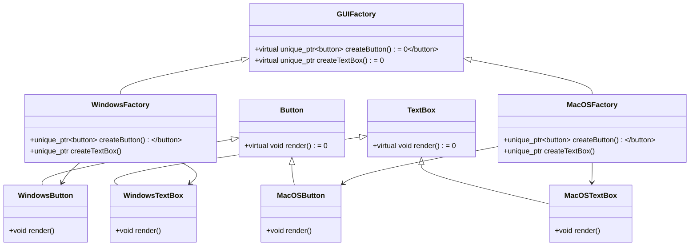

# Abstract Factory模式简介
Abstract Factory是一种创建型设计模式，提供一个接口，用于创建一系列相关或互相依赖的对象，而无需指定它们的具体类。它通常用于以下场景：

# 适用场景
- 产品族之间存在约束关系：需要确保同一产品族中的对象能够一起工作。例如，一个GUI库可能需要确保按钮和文本框属于同一主题（Windows风格、Mac风格）。
- 隐藏具体实现：客户端只关心接口，而不关心具体实现细节。
- 希望提高可扩展性：可以方便地新增一整套相关产品，而不需要修改现有代码。
# Abstract Factory的角色
- 抽象工厂接口（AbstractFactory）：定义创建抽象产品的接口。
- 具体工厂（ConcreteFactory）：实现抽象工厂，生产一组具体产品。
- 抽象产品接口（AbstractProduct）：定义产品的接口。
- 具体产品（ConcreteProduct）：实现具体产品。
- 客户端（Client）：使用工厂来获取产品。
# C++ 示例：跨平台GUI组件
假设需要构建一个跨平台的GUI库，支持 Windows 和 MacOS 两个平台，每个平台有不同风格的按钮和文本框。
# 优点
- 分离接口和实现：客户端只依赖抽象接口。
- 一致性：保证一组产品（例如按钮和文本框）使用相同的风格。
- 扩展性：新增一个平台风格（如Linux）时，只需要增加对应的工厂和产品实现。
# 缺点
- 复杂性增加：引入了更多的类和接口。
- 扩展不够灵活：需要为每个产品族增加新工厂，无法动态组合产品族。

